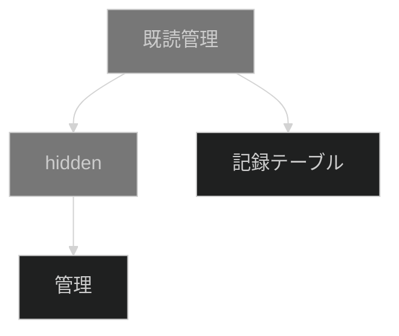

これは[2023 個人アドベントカレンダー](https://qiita.com/advent-calendar/2023/doityourself)の 6 日目の記事です。

## tl;dr

- [以前の記事](https://zenn.dev/ulpianus/articles/8d0b4e35be12f6)の自己改善
  - このときは、自分自身のレコードに更新をするものだったため、複数人の既読に対応できないことと、リロードが必要となることに課題を感じた。
- 別のテーブルを使って、既読を管理する方法でやってみた
  - 既読 n 人みたいな情報と自分が見たかどうかを情報として提示できる

## 実装

サイトパッケージは gist から取得してください。

### サイトの構成

下図の構成で作成しました。「既読管理」は単にまとめるためのフォルダです。
「hidden」もフォルダでこれは既読の状態管理をする「管理」テーブルを一般ユーザに対して隠蔽するための仕組みとなります。

記録テーブルが閲覧用のテーブルで、既読管理の対象となっており、管理は既読状態を管理するためのテーブルです。

### サイト：記録テーブル

#### データ項目

このサイトでは、チェック項目と数値項目を使って自身の既読状態と既読人数をユーザに提示します。
機能の都合上、これらの項目は読取専用とします。

#### サーバスクリプト

これらの項目には、サーバスクリプトを使って、「管理」テーブルから、レコードを読み出して埋めます。
ポイントとなるのが、このサーバスクリプトの条件に「行表示の前」と「画面表示の前」にチェックを付けることです。
行表示の前にチェックを付けることで、一覧表示においてもレコードの各行ごとにサーバスクリプトが情報を取得・表示できるようになります。
また、画面表示の前をつけることで、編集画面でもサーバスクリプトを発動させることができます。

このとき「レコード読み込み時」にはチェックを付けないことにご留意ください。行表示の前と画面表示の前の 2 つにチェックを付けるかわりにレコード読み込み時にチェックをつけることで、一覧・編集の両画面でサーバスクリプトを動作させ、期待の表示を作ることができます。
ただ、「レコード読み込み時」ではレコードを変更させることになるため[^1]、その後にユーザがレコードの更新を行った場合、その時点のデータでデータが書き込みが起こります。とりわけ対象の項目が読取専用であっても書き込みが起こる点に注意が必要です。
今回の場合、チェックと数値の項目はあくまでデータ表示のための枠であり、動的な計算で表示を決めるため、これらの場所に途中時点のデータを書き込むのは妥当ではありません。
もちろん Pleasanter のアプリケーションで利用する限り、サーバスクリプトで最新の情報が提示され続けると期待されますが、データベースに実情と乖離している可能性のある値が残るのは避けるべきと考えました。

#### スクリプト

スクリプトでは、編集画面に一定時間滞在した場合に「管理」テーブルにロギングをする処理があります。
一定時間表示して既読になるのは、メーラーなどで採用されている方法なのでこの実装を選択しました。
方法としては、サーバスクリプトでロギングをすることも可能だとは考えられますが、画面をロードした瞬間か、更新やプロセスのボタン操作をしたときに既読になるのはタイミングとしてやや妥当でないと考えました。

### サイト：管理

このサイトでは、担当者項目と数値項目を使って誰がどのレコードを訪問したかを記録します。
データ量に依存しますが、管理テーブルは複数のサイトを横断して既読情報を蓄積する目的で共用可能と考えられます。

#### サーバスクリプト

人数カウントをする性質上、同じレコードを同じ人が訪問した記録が残るのは妥当ではないため、サーバスクリプトで重複の制御をしています。
条件は「作成前」で、担当者と数値(レコード ID)が既に存在している場合には、作成エラーにしています。

Pleasanter のテーブル管理では項目に対する重複禁止の設置がありますが、複数の項目を組み合わせには対応していません(多分、今も)
このようにサーバスクリプトなどで実装上禁止するほか、タイトル結合をして結合したタイトル項目がその項目だけで重複を排除できる設定にするといった方法でも複数の項目を組み合わせての重複禁止が可能となると思います(未検証)。

#### アクセス権限

ややポリシーの問題になるのですが「管理」テーブルは、一般ユーザには見せないほうが良いと考えています。
他人の行動ログを見ることを機微情報へのアクセスとは思わない考えもあるでしょうし、削除や更新を禁止すればデータの一貫性は保たれますが、管理のための情報はユーザにとってはノイズでしかないためです。

このとき、「管理」テーブル自体のサイトのアクセス制御では、うまく隠蔽できません。
サイトのアクセス制御で、読取専用にして、読取専用のサイトを非表示にすることで隠蔽すると、既読情報の作成ができなくなります。

かといって、作成権限をつけると、読取専用ではなくなるので、非表示になりません。

また、読取権限を奪って、作成権限だけを付与すると、「管理」テーブルそのものは見えますが、(特に他人の)レコードは隠蔽できます。
ただ、この場合、既読人数の情報が取れなくなりますし、レコードのアクセス制御で読取権限を付与しなければ、自身の既読も取得できず一向に既読にならない状態になります[^2]。

このため「管理」テーブルのサイトのアクセス制御としては、読取と作成の両権限が一般ユーザにとって必要ということになります。

### フォルダ：hidden

hidden フォルダはサイトのアクセス権限をシステムの管理者相当に絞ります。
こうすることで、このフォルダ自身とその内部にある「管理」テーブルを、利用者から隠蔽できます。

これは[去年アクセス権限を無視したサイトの列挙はやってはいけないという記事で挙げた例](http://localhost:8000/articles/a72093ee3852d3#%E5%95%8F%E9%A1%8C-3%3A%E3%82%A2%E3%82%AF%E3%82%BB%E3%82%B9%E6%A8%A9%E9%99%90%E3%81%AE%E3%81%AA%E3%81%84%E3%83%95%E3%82%A9%E3%83%AB%E3%83%80%E3%81%AE%E9%85%8D%E4%B8%8B%E3%81%AE%E3%82%A2%E3%82%AF%E3%82%BB%E3%82%B9%E6%A8%A9%E9%99%90%E3%81%8C%E3%81%82%E3%82%8B%E3%82%B5%E3%82%A4%E3%83%88%E3%81%8C%E8%A6%8B%E3%81%88%E3%82%8B)の適用例となります。

## まとめ

- 既読管理を一段抽象化してみた
- 作ってて思ったけど、この仕組みを使えば「いいね数」とかをうまい具合に出せそう
  - スクリプトで時間で書き込むのではなく、プロセスで「いいね」ボタンをつくってそれを押したときに管理テーブルに書けばいけそう。
  - 以前、複数選択の分類型にユーザ ID を詰め込む方法で「いいね」を作ったときに、「ID 値といいねした人数によってはデータ型から容易にあふれるよ」と指摘されたことがあって、そのアンサーソングになってることを途中で気付きました。届け!

[^1]:
    [開発者向け機能：サーバスクリプト：条件](https://pleasanter.org/manual/server-script-conditions)

    > 「レコード」読み込み後に項目の内容を変更する際に使用します。

[^2]: このとき、裏では既読ログが訪問のたび多重に記録されることになります。なぜならサーバスクリプトでは権限のないレコードが取れず、先行するレコードに対して重複しているという判定ができず、重複禁止のロジックが働かなくなるためです。
